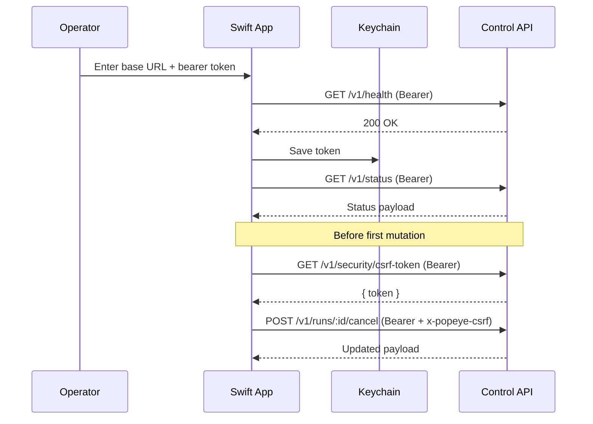
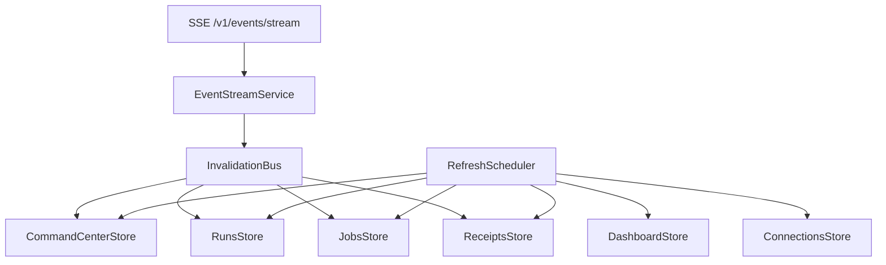

# Popeye macOS Dashboard/Client Architecture

## Purpose

This document defines the technical architecture for Popeye’s native macOS SwiftUI client. It is written to let an implementation agent build the app without drifting from the repo’s existing runtime and control-plane boundaries.

The architecture here is opinionated:

- control API first
- thin native client, not hidden backend
- feature-oriented SwiftUI structure
- Swift Concurrency over callback-heavy plumbing
- read-heavy first, explicit mutation paths later
- current generated Swift code treated as insufficient until the codegen/export path is repaired

---

## Repo-truth conclusions that shape the technical plan

## 1. The native client is still a blank slate

`apps/macos/README.md` is a deferred note, not an app scaffold. The native architecture can still be chosen cleanly, but it must stay faithful to the existing control API and web-inspector proof points.

## 2. The real contract source is the Zod/contracts + control API, not the current Swift codegen output

The strongest repo truth today is:

- Zod schemas in `packages/contracts`
- the `packages/control-api` implementation
- the `packages/api-client` TypeScript client
- the web inspector’s actual endpoint usage

The generated Swift output exists, but it should not currently define the internal Swift architecture.

## 3. Browser auth is web-only; native should use bearer auth directly

The web inspector uses a bootstrap nonce plus `POST /v1/auth/exchange` to mint an HttpOnly browser session cookie. That is correct for a loopback browser app.

The native client is different:

- it can and should use bearer auth directly
- it should fetch CSRF tokens for mutations with bearer auth
- it does not need browser cookies for its own API access

## 4. Current API breadth is enough for a useful native client

The control API already supports:

- daemon health/status/scheduler
- runs/jobs/tasks/receipts/interventions
- approvals, standing approvals, automation grants, security policy
- connections and provider-adjacent routes
- usage and security audit
- many domain surfaces

This means Phase 1–3 native work does **not** require inventing new backend subsystems.

## 5. Two important refinements are still needed

The clean native build is helped materially by:

1. an auth/principal introspection endpoint
2. a repaired schema/codegen pipeline for Swift

The app can begin before both land, but they should be tracked as early follow-on backend work.

---

## Architectural invariants

These are non-negotiable unless the repo itself changes.

1. **The app talks to Popeye only through the control API.**
2. **No direct SQLite reads.**
3. **No runtime-file heuristics as a substitute for real endpoints.**
4. **No business logic embedded in SwiftUI views.**
5. **All mutations respect the existing auth/role/CSRF model.**
6. **The app may cache view state, not re-own domain truth.**
7. **The native app remains replaceable because the API boundary remains primary.**
8. **Unsupported flows should hand off to web/CLI rather than tunneling around the architecture.**

---

## Recommended implementation shape

## Primary recommendation

Build a **standard macOS SwiftUI app target** under `apps/macos/`, using:

- SwiftUI
- Observation / `@Observable` state where deployment target allows
- Swift Concurrency (`async/await`, actors)
- `URLSession`
- `Codable`
- `os.Logger`
- Keychain for bearer token storage
- `XCTest` / `XCUITest`

Use Apple frameworks first. Do not add a network or state-management dependency unless the app proves it truly needs one.

## Why not over-modularize immediately

The repo currently has no native app code. The first mistake would be building an elaborate local architecture before the operator flows exist.

Start with:

- one app target
- one unit-test target
- one UI-test target

Extract internal Swift packages only when there is demonstrated complexity, not because “MVVM” suggests it.

---

## App architecture overview

```mermaid
flowchart LR
    A[SwiftUI Views] --> B[Feature Stores / View Models]
    B --> C[Feature Services]
    C --> D[ControlAPIClient actor]
    D --> E[Loopback Control API /v1]
    E --> F[Popeye runtime-core]

    D --> G[EventStreamService actor]
    G --> B

    H[CredentialStore / Keychain] --> D
    I[App Preferences / AppStorage] --> B
    J[DiagnosticsStore] <-- D
    J <-- G
```

### Layer summary

- **Views:** rendering and user interaction only
- **Feature stores/view models:** feature state, derived display models, intent handling
- **Services:** endpoint grouping and multi-call orchestration
- **ControlAPIClient:** low-level authenticated HTTP + decoding + CSRF handling
- **EventStreamService:** SSE lifecycle and invalidation signals
- **CredentialStore:** secure token/base URL storage
- **DiagnosticsStore:** in-memory request/event diagnostics for debugging and support

---

## Recommended repo structure

```text
apps/macos/
  README.md
  PopeyeMac.xcodeproj/
  PopeyeMac/
    App/
      PopeyeMacApp.swift
      AppModel.swift
      AppEnvironment.swift
      Navigation/
        AppRoute.swift
        SidebarSection.swift
        WindowState.swift
      Settings/
        SettingsView.swift
    Core/
      API/
        ControlAPIClient.swift
        APIError.swift
        Endpoint.swift
        RequestBuilder.swift
        ResponseDecoder.swift
        DTO/
          System/
          Execution/
          Governance/
          Connections/
          Domain/
      Auth/
        CredentialStore.swift
        KeychainStore.swift
        ConnectionSession.swift
        AuthBootstrapViewModel.swift
      LiveUpdates/
        EventStreamService.swift
        EventStreamParser.swift
        RefreshScheduler.swift
        InvalidationBus.swift
      Services/
        SystemService.swift
        OperationsService.swift
        GovernanceService.swift
        ConnectionsService.swift
        UsageSecurityService.swift
      Diagnostics/
        DiagnosticsStore.swift
        Logger+Popeye.swift
      Formatting/
        DateFormatting.swift
        DurationFormatting.swift
        CurrencyFormatting.swift
        IdentifierFormatting.swift
      PreviewSupport/
        PreviewFixtures.swift
        PreviewEnvironment.swift
    Features/
      Connect/
      Dashboard/
      CommandCenter/
      Runs/
      Jobs/
      Receipts/
      Interventions/
      Approvals/
      Connections/
      UsageSecurity/
      Shared/
        Components/
        Models/
        Filters/
        EmptyStates/
    Resources/
      Info.plist
      Assets.xcassets
  PopeyeMacTests/
  PopeyeMacUITests/
```

## Notes on this structure

- `Core/API/DTO` contains transport-level Swift `Codable` types for the subset actually used.
- `Features/*` owns view models, feature services adapters, and views for a single operator surface.
- `Features/Shared` holds reusable UI primitives; do not let it become a dumping ground.
- `Core/Services` groups raw endpoint usage by backend concern, not by screen.
- `Core/LiveUpdates` remains global because the event stream is shared infrastructure.

---

## Module and responsibility breakdown

## 1. App layer

Files:
- `PopeyeMacApp.swift`
- `AppModel.swift`
- navigation primitives
- settings scene

Responsibilities:
- scene setup
- window creation
- global navigation
- app-wide connection status
- app command registration (refresh, shortcuts)
- injecting environment dependencies

Must **not**:
- decode API payloads
- own endpoint logic
- contain run/job/receipt heuristics directly

## 2. Core/API layer

Files:
- `ControlAPIClient.swift`
- endpoint builders
- request/response helpers
- DTOs
- decoding configuration

Responsibilities:
- authenticated HTTP requests
- `GET` / `POST` / `PATCH` / `DELETE`
- CSRF token fetching for mutations
- decoding into DTOs
- retry classification and error normalization
- SSE request bootstrap

Must **not**:
- know about SwiftUI
- perform screen-specific composition
- expose raw stringly typed JSON blobs upward where structured decoding is possible

## 3. Core/Auth layer

Responsibilities:
- store/retrieve bearer token securely
- store base URL and simple preferences
- validate connectivity
- manage connected/disconnected state
- clear credentials on explicit sign-out or unrecoverable auth failure

Must **not**:
- parse Popeye runtime databases
- read internal auth storage files unless explicitly blessed later

## 4. Core/Services layer

Responsibilities:
- group related API operations into stable service boundaries
- hide endpoint details from feature stores
- orchestrate multi-call snapshots

Recommended services:

- `SystemService`
- `OperationsService`
- `GovernanceService`
- `ConnectionsService`
- `UsageSecurityService`

Later:
- `InstructionsService`
- `MemoryService`
- `PeopleService`
- `FilesService`
- `DomainDigestService` (email/calendar/github/todos/finance/medical)

## 5. Core/LiveUpdates layer

Responsibilities:
- maintain SSE connection
- parse event stream lines
- publish invalidation events
- surface live/stale state
- coordinate with polling

This layer should **not** try to become a full replica/state engine in v1.

## 6. Feature layer

Each feature owns:
- screen-local state
- filters/sort options
- selection
- derived rows/cards
- load/reload actions
- mutation intents allowed for that feature

Each feature should expose:
- one main store/view model
- one root view
- optional detail/inspector subviews
- test fixtures

---

## View / ViewModel / Service / Model boundary

## View

A SwiftUI view should:

- bind to observable feature state
- render lists, tables, cards, and inspector panes
- send intents (`refresh`, `selectRun`, `approve`, `retryRun`)
- own tiny UI-only concerns (focus, hover, sheet visibility)

A view should **not**:
- compute stuck-risk logic
- build HTTP requests
- parse dates ad hoc
- decide endpoint fallback behavior

## Feature store / view model

A feature store should:

- call services
- map DTOs to display models
- own loading/error/empty state
- own selection and filters
- own derived heuristics that are feature-specific

Examples:
- command-center attention derivation
- freshness calculations
- row grouping / sorting

A store should **not**:
- build raw `URLRequest`s
- reach into Keychain directly
- duplicate logic that belongs in a shared service/helper

## Service

A service should:

- expose stable functions like `loadDashboardSnapshot()` or `loadRunDetail(id:)`
- coordinate multiple endpoint calls
- return typed snapshots

A service should **not**:
- own view selection state
- store long-lived app UI preferences
- know about specific sheet presentations

## DTO model vs display model

Use a two-step model strategy:

1. **Transport DTOs** mirror the control API payloads used by the app.
2. **Display models** adapt DTOs for UI needs.

Do not use DTOs as the final display surface in dense views if doing so creates formatting churn or optionality leaks.

---

## API client strategy

## Recommendation

Create a single low-level `ControlAPIClient` actor, then build thin service wrappers on top.

### Why an actor

An actor cleanly owns:

- base URL
- bearer token access
- CSRF token cache
- request serialization for token refresh paths
- diagnostics capture

### ControlAPIClient responsibilities

- send authenticated requests to `/v1/*`
- add `Authorization: Bearer <token>`
- fetch and cache CSRF token before mutations
- decode JSON payloads
- normalize transport and API errors
- expose SSE byte stream creation for the event service

### Example API shape

```swift
actor ControlAPIClient {
    func health() async throws -> HealthResponseDTO
    func status() async throws -> DaemonStatusDTO
    func schedulerStatus() async throws -> SchedulerStatusDTO
    func listRuns(filter: RunFilter?) async throws -> [RunRecordDTO]
    func getRun(id: String) async throws -> RunRecordDTO
    func listRunEvents(runID: String) async throws -> [RunEventDTO]
    func retryRun(id: String) async throws -> JobRecordDTO?
}
```

This should mirror the TypeScript client grouping, not the SwiftUI screen tree.

## Generated Swift models: direct use or wrapper?

### Recommendation

**Do not use the current generated Swift models directly as the app’s primary model layer.**

Use one of these approaches:

### v1 approach (recommended)

- create hand-authored `Codable` DTOs for the subset of endpoints used in Phase 1–4
- keep them close to the actual Zod/control-api truth
- map DTOs to display models in stores/services

### later approach

- once schema export / Swift codegen is fixed, generate transport DTOs into `Core/API/Generated/`
- keep a wrapper/adapter layer so UI code is insulated from generator churn

### Why

The current generated Swift file is too lossy to anchor a serious app, but the underlying contracts are solid enough to hand-author a stable subset quickly.

---

## Auth, session, and bootstrap design

## Authentication mode

Use **bearer auth** directly for the native client.

### Do not use for native API access

- `POST /v1/auth/exchange`
- browser-session cookie auth as the app’s main session mode
- bootstrap nonce mechanics intended for HTML

Those are web concerns.

## First-run bootstrap flow

1. Present Connect screen.
2. User enters loopback base URL and bearer token.
3. App validates connectivity using lightweight read endpoints.
4. App stores token in Keychain and base URL in app preferences.
5. App loads dashboard snapshot.

### Recommended validation sequence

- `GET /v1/health`
- `GET /v1/status`
- optionally `GET /v1/security/csrf-token` to verify mutation readiness

### Role handling

Current repo truth lacks a dedicated “who am I” endpoint. Because of that:

- v1 can connect without knowing role precisely
- write actions should surface 403 cleanly
- Phase 0/1 should request a backend addition:
  - `GET /v1/auth/context` or similar
  - returns auth mode and role for the current principal

## Token storage

- store bearer token in macOS Keychain
- store base URL and non-sensitive UI preferences in `AppStorage` / `UserDefaults`
- never log the token
- never mirror it into view state or diagnostics

## Token rotation behavior

Because Popeye supports token rotation with overlap:

- the app should continue using the stored token until a 401/403 indicates it is no longer valid for the desired action
- on 401, show a reconnect/update-token prompt
- do not auto-read runtime auth files to “self-heal”

---

## Loopback access and ATS considerations

The app will talk to `http://127.0.0.1:3210` by default.

Implementation notes:

- configure App Transport Security exceptions or local-network allowances needed for loopback HTTP
- scope any ATS relaxation narrowly to loopback/local use
- do not enable broad arbitrary-load exceptions for convenience

This should be captured in the app target configuration, not worked around in code.

---

## CSRF, token, cookie, and local-auth considerations

## Request rules

### Read requests

- bearer auth only
- no CSRF required

### Mutation requests

- bearer auth
- fetch CSRF token from `GET /v1/security/csrf-token` when needed
- send `x-popeye-csrf`
- it is acceptable to send `Sec-Fetch-Site: same-origin`, mirroring the JS client, though browser semantics are not the point here

## Native app should not rely on cookies

The app is not a browser. Cookie-backed browser sessions are not the correct native auth abstraction.

## CSRF token caching

Cache the CSRF token in-memory per connected session.

Invalidate and refetch when:

- the token is missing
- the base URL changes
- the bearer token changes
- a mutation returns CSRF-related failure

---

## Auth/CSRF sequence



---

## Live updates: SSE + polling

## Recommendation

Use a hybrid model:

- **polling** for canonical state refresh
- **SSE** for liveness and invalidation

## Why not SSE-only

The event stream today is useful for freshness and targeted wakeups, but a v1 native app should not depend on perfectly modeling every event payload before it can stay consistent.

## EventStreamService design

Responsibilities:

- open `/v1/events/stream` with bearer auth
- parse `event:` / `data:` SSE frames
- publish:
  - connection state
  - last event time
  - event type
  - raw data or parsed envelopes where helpful
- notify an `InvalidationBus` that relevant views should refetch

### Initial event usage

At first, treat SSE as an invalidation hint for:
- runs
- jobs
- interventions
- receipts
- security audit / command-center freshness

Do **not** build a reducer-heavy replicated state engine in Phase 1.

## Polling rules

Centralize polling so features do not all spawn independent unmanaged timers.

Use a `RefreshScheduler` that understands:

- visible feature
- app active/inactive state
- active selection
- current connectivity
- backoff after repeated failures

---

## Live update topology



---

## Concurrency model

## Main principles

- keep networking off the main actor
- keep feature state updates on the main actor
- cancel stale tasks aggressively
- avoid overlapping duplicate loads where possible

## Specific recommendation

- `ControlAPIClient` is an `actor`
- `EventStreamService` is an `actor`
- feature stores are `@MainActor`
- heavy formatting / transformation remains light enough to happen in-store unless profiling says otherwise

## Per-feature loading pattern

A typical feature store should:

1. cancel any previous task for the same load intent
2. mark loading state
3. call service methods concurrently where useful
4. publish snapshot or error
5. preserve prior data during refresh when possible

### Good use of concurrency

Dashboard snapshot:
- load status
- scheduler
- engine capabilities
- usage
- possibly connections summary / security audit

These can run concurrently.

### Avoid

- fire-and-forget network work with no cancellation path
- ad hoc timers inside views
- feature stores reaching across to mutate other feature state directly

---

## Error handling and retry architecture

## Error taxonomy

Define an app-level error shape that distinguishes:

- `transportUnavailable`
- `unauthorized`
- `forbidden`
- `csrfInvalid`
- `notFound`
- `decodeFailure`
- `apiFailure(message)`
- `unsupportedSurface`
- `staleData`

Feature stores should map these into user-facing states without losing the underlying technical reason.

## Retry behavior

### Automatic retry

Safe for:

- SSE reconnect
- dashboard polling
- read-only refreshes after transient transport failures

### Manual retry only

Required for:

- mutations
- repeated decode failures
- auth failures
- role failures

## Preserve context on failure

If a refresh fails but the app has prior data:
- keep the prior data visible
- mark it stale
- show retry affordance

Do not drop into a blank screen unless there is no previously loaded state.

---

## Logging and diagnostics strategy

## Logging

Use `os.Logger` with categories such as:

- `app`
- `auth`
- `network`
- `events`
- `refresh`
- `features.dashboard`
- `features.commandCenter`

Never log:
- bearer tokens
- CSRF tokens
- sensitive payload content beyond what is already safe to display

## DiagnosticsStore

Maintain an in-memory diagnostics store containing:

- recent requests
- route
- method
- duration
- status code
- decode success/failure
- last SSE connect/disconnect
- current base URL
- connection freshness

This is useful for:
- development
- manual QA
- future in-app diagnostics panel
- bug reports

Do not persist this store by default.

---

## Local persistence and caching strategy

## Persist

- base URL
- selected navigation item
- panel layout/density preferences
- window restoration state
- last selected workspace filter
- bearer token in Keychain only

## Keep in memory only

- fetched dashboard snapshots
- run/job/receipt lists
- event stream data
- approval/intervention context
- connections overview data

## Do not persist in v1

- large domain caches
- receipt bodies
- memory search results
- people/medical/finance data
- raw event history

### Why

The runtime already owns the durable truth. The native app should not quietly become a second datastore, especially for sensitive domain data.

---

## Preview and mocking strategy

## Goal

Make the app implementable before every live endpoint is wired.

## Recommendation

Create a `PreviewSupport` layer with:

- fixture JSON files modeled from actual control API responses
- fixture builders for display models
- mock service protocols

Example:
- `MockSystemService`
- `MockOperationsService`
- `MockGovernanceService`

### Use cases

- SwiftUI previews for dashboard cards
- command-center states (healthy, stale, failed, empty)
- run detail previews with long event timelines
- approval detail previews
- UI tests without a real daemon

## Important rule

Mock data should be grounded in actual repo contracts and real payload shapes, not invented UI-only fantasy types.

---

## Test architecture

## Unit tests

Cover:

- DTO decoding
- formatters
- derived heuristics (idle, stuck-risk, freshness)
- service snapshot composition
- mutation intent flows
- error mapping

## Networking tests

Use a custom `URLProtocol` test double to verify:

- bearer header inclusion
- CSRF token fetch before mutation
- retry/backoff behavior where applicable
- SSE parser correctness from byte streams

## Feature-store tests

Cover:
- initial load
- refresh with prior data retained
- empty states
- selection changes
- auth failure behavior
- role/forbidden behavior

## UI tests

Smoke-test:

- bootstrap/connect flow
- dashboard load
- navigation between major views
- inspector presentation
- one or two mutation confirmation flows once added

---

## Packaging and signing considerations

## Development

- Xcode-run local app against local daemon
- no packaging complexity should block Phase 1–3 development

## Release direction

The repo’s release direction is a signed, notarized macOS `.pkg`. The native app should fit that world, not invent a separate installer story.

### Recommendation

- plan for the native app to ship as part of the broader Popeye macOS distribution once mature
- sign and notarize with the same release discipline as the rest of Popeye
- keep entitlements minimal

## Sandbox and entitlements

Recommended default posture:

- prefer a sandboxed app if loopback networking and planned capabilities remain straightforward
- enable outbound network client capability
- avoid file access entitlements in v1
- use Keychain appropriately
- if sandbox friction becomes disproportionate, reassess explicitly rather than quietly expanding scope

---

## How the native app stays aligned with the control API

## Alignment rules

1. Every feature begins from an existing endpoint.
2. Every mutation maps to an existing route and role requirement.
3. Any “missing convenience” should be solved by additive API work, not client-side runtime coupling.
4. Screen models should remain derivations of API truth, not alternate truth sources.
5. Unsupported workflows should be called out openly.

## Practical alignment mechanisms

- name Swift services after backend concerns
- keep endpoint names visible in code comments or tests
- add fixture payloads captured from real API responses
- gate new native features on contract evidence, not aspiration
- track any backend additions in `docs/macos-dashboard/open_questions.md`

---

## Backend/API changes recommended before broad native expansion

## 1. Auth principal introspection endpoint

### Recommended endpoint

`GET /v1/auth/context`

### Suggested response

```json
{
  "mode": "bearer",
  "role": "operator"
}
```

### Why

The native app needs to:
- show current permission level
- disable or hide write surfaces appropriately
- avoid role inference through failed writes

## 2. Repair generated schema/codegen output

### Goal

Make generated Swift transport types trustworthy enough for expansion beyond the first subset.

### Needed improvements

- preserve booleans/numbers
- preserve nested objects
- preserve optionals/nullability
- preserve enum types
- produce real JSON Schema, not empty definitions
- define date decoding conventions explicitly

## 3. Consider command-center summary endpoints if polling gets noisy

Possible additive endpoints:
- `GET /v1/command-center/summary`
- `GET /v1/runs/active`
- `GET /v1/jobs/active`

These are not required to begin, but they may simplify native and web performance if fan-out grows.

## 4. Clarify daemon lifecycle control strategy

Historical docs mention daemon start/stop/restart via control API, but the current control API only exposes daemon state/scheduler reads. The native app should **not** invent daemon control. Either:
- add explicit lifecycle endpoints later, or
- keep lifecycle management CLI/installer-first

---

## Implementation guidance for Phase 1

Build the smallest clean vertical slice:

1. connect screen
2. credential storage
3. low-level API client
4. dashboard snapshot service
5. dashboard view with live refresh
6. diagnostics and preview fixtures

Do not start by scaffolding every feature folder or trying to mirror the whole web inspector.

---

## Final technical recommendation

Build the macOS client as a **thin, strongly typed SwiftUI operator console** with:

- a single authenticated loopback API client
- a small service layer
- feature stores that own UI state and derived heuristics
- polling + SSE invalidation
- Keychain-backed bearer auth
- no direct runtime/database coupling
- hand-authored transport DTOs for the first subset
- generated-model adoption only after the codegen path is fixed

That keeps the app clean, testable, and aligned with Popeye’s actual architecture.
